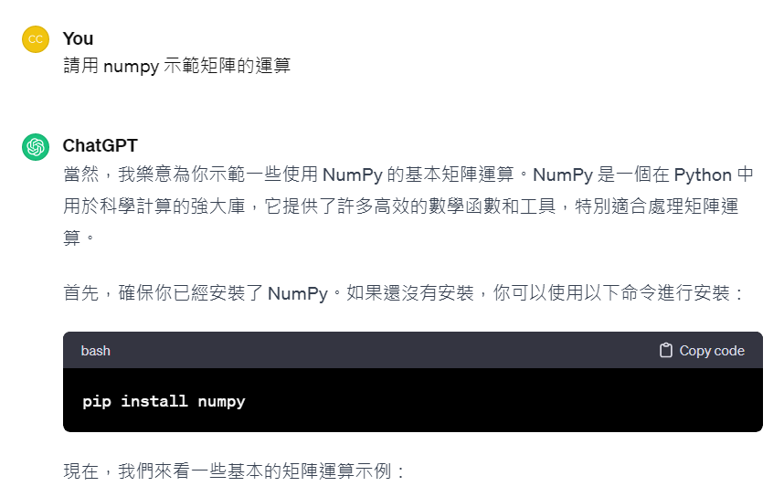

# ChatGPT 語言模型

OpenAI 在 2022 年 11 月推出的 ChatGPT ， 讓整個世界的焦點都關注在《大型語言模型》上，人工智慧因此再度成為熱門主題，你可以參考以下維基百科的說明：

* https://zh.wikipedia.org/zh-tw/ChatGPT

我們也可以叫 ChatGPT 介紹自己

* https://chat.openai.com/share/236761c4-d397-4845-ba76-159e4296bd8e


或者叫 ChatGPT 教我們寫程式

* https://chat.openai.com/share/24c21086-81af-4fda-823f-5a6a29bd6e93



```py
import numpy as np

# 創建矩陣
A = np.array([[1, 2, 3],
              [4, 5, 6],
              [7, 8, 9]])

B = np.array([[9, 8, 7],
              [6, 5, 4],
              [3, 2, 1]])

# 矩陣加法
C = A + B
print("矩陣相加的結果：")
print(C)

# 矩陣減法
D = A - B
print("\n矩陣相減的結果：")
print(D)

# 矩陣乘法
E = np.dot(A, B)
print("\n矩陣相乘的結果：")
print(E)

# 轉置矩陣
A_transpose = A.T
print("\nA的轉置矩陣：")
print(A_transpose)

# 矩陣的元素-wise 乘法
F = A * B
print("\n矩陣的元素-wise 乘法的結果：")
print(F)

# 矩陣的元素-wise 除法
G = A / B
print("\n矩陣的元素-wise 除法的結果：")
print(G)

```

而且，ChatGPT 寫出來的程式常常是可以跑的，只是有時候有錯，需要你修正一下

```
$ python numpy1.py
矩陣相加的結果：
[[10 10 10]
 [10 10 10]
 [10 10 10]]

矩陣相減的結果：
[[-8 -6 -4]
 [-2  0  2]
 [ 4  6  8]]

矩陣相乘的結果：
[[ 30  24  18]
 [ 84  69  54]
 [138 114  90]]

A的轉置矩陣：
[[1 4 7]
 [2 5 8]
 [3 6 9]]

矩陣的元素-wise 乘法的結果：
[[ 9 16 21]
 [24 25 24]
 [21 16  9]]

矩陣的元素-wise 除法的結果：
[[0.11111111 0.25       0.42857143]
 [0.66666667 1.         1.5       ]
 [2.33333333 4.         9.        ]]
```

如果你還沒用過 ChatGPT ，趕快去下列網址申請個帳號，然後開始使用吧！

* https://chat.openai.com/
