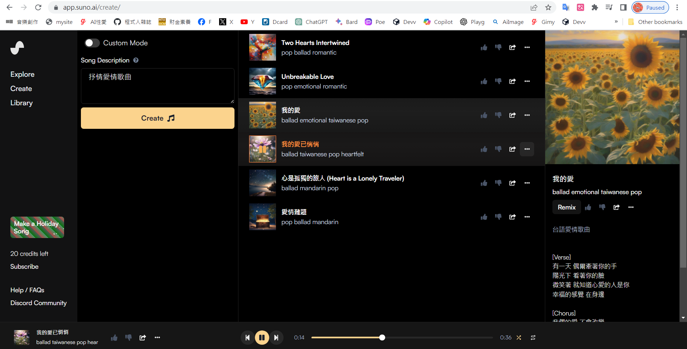

# 用 suno 自動作曲作詞

我從沒想過

有一天我會變成《周杰倫+方文山》 

...

直到我用了 suno

* https://suno.ai/

你可以在下列網址看到其他人用 suno 做的歌

* https://app.suno.ai/

然後到下列網址打句話，她就幫你做好幾首歌了

* https://app.suno.ai/create/

你可以聽聽我剛剛花了十秒鐘做的六首歌

1. [Two Hearts Intertwined.mp3](song/Two%20Hearts%20Intertwined.mp3)
    * [線上聽](https://app.suno.ai/song/57a5f591-d5d5-4161-a06e-0184297032fa)
2. [Unbreakable Love.mp3](song/Unbreakable%20Love.mp3)
    * [線上聽](https://app.suno.ai/song/c5469eb3-f2dc-4f68-88c9-43ddcdaff6ba)
3. [心是孤獨的旅人.mp3](song/心是孤獨的旅人.mp3)
    * [線上聽](https://app.suno.ai/song/e7874e22-b282-4ec2-88e9-1aac5f508ea3)
4. [我的愛.mp3](song/我的愛.mp3)
    * [線上聽](https://app.suno.ai/song/bc91b027-9d8e-49d5-9550-b27f5585a2c3)
5. [我的愛已悄悄.mp3](song/我的愛已悄悄.mp3)
    * [線上聽](https://app.suno.ai/song/c0dc7e5a-6e28-42b3-97b6-d84c69890372)
6. [愛情難題.mp3](ong/愛情難題.mp3)
    * [線上聽](https://app.suno.ai/song/9e6ec207-c31c-43e6-9443-126d54fb6fd0)

不錯吧！

現在、人人都是《周杰倫+方文山》了 ...

